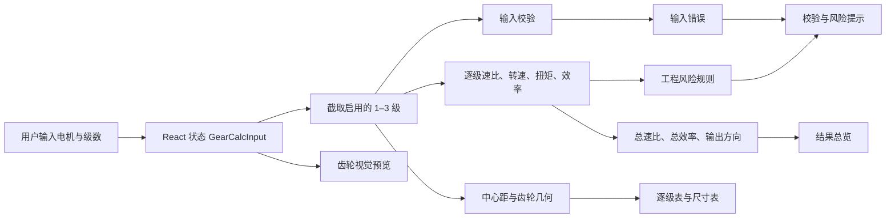
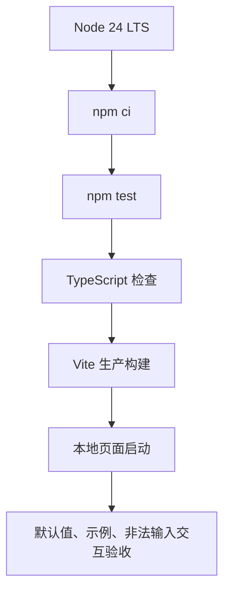
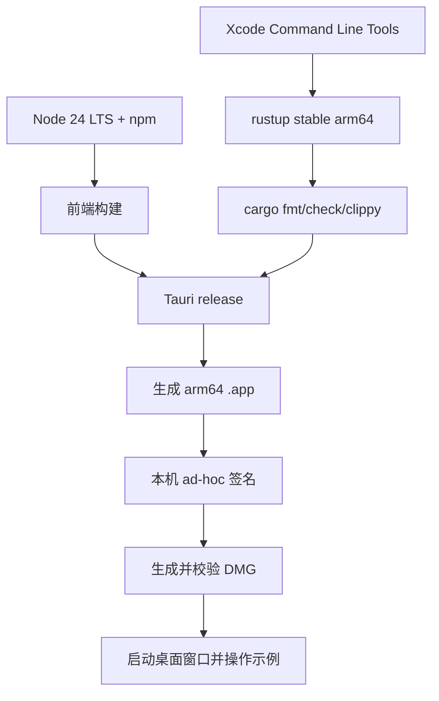

# GearCalc-3Stage Flow

## 运行时数据流

所有计算发生在前端内存中。当前没有网络请求、数据库、文件写入或 Tauri IPC。

## 逐级计算顺序

1. 将级数约束到 1–3；
2. 只取 `stages` 中启用的前 N 级；
3. 校验电机、压力角、模数、齿数和效率；
4. 无效齿数归零，不继续形成有效齿轮副；
5. 计算本级速比；
6. 用上一级输出作为下一级输入；
7. 累乘总速比和总效率；
8. 计算中心距和两只齿轮的基础尺寸；
9. 生成输入错误与工程风险；
10. React 同步刷新总览、预览、表格和提示。

## Web 工程闭环

通过条件：

- npm 审计无已知漏洞；
- 计算测试全部通过；
- TypeScript 和 Vite 构建通过；
- 默认参数与独立公式一致；
- 两级真实参数与独立公式一致；
- 非整数齿数显示明确错误并停止有效输出；
- 浏览器控制台无错误。

## macOS Tauri 工程闭环

本机工程验收与公开发布必须分开：

- 本机验收：ad-hoc 签名即可验证应用结构、启动和交互；
- 公开发布：需要 Apple Developer ID、正式签名、公证、stapling 和另一台 Mac 的 Gatekeeper 验证；
- 仓库中不得保存证书、私钥、账号密码或公证凭据。

## 回归验收参数

推荐保留以下两组：

1. 默认一级：1500 rpm、0.2 N·m、20→40 齿、95%，期望输出 750 rpm、0.38 N·m；
2. 两级解释样例：1450 rpm、0.5 N·m，20→60 齿/95%，18→72 齿/94%，期望总速比 12、总效率 89.3%、输出 120.83 rpm 和 5.358 N·m。

仓库内置三级示例主要用于同时验证多级计算、低齿数提示和三级累计风险。
